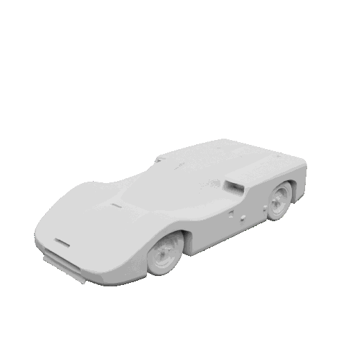
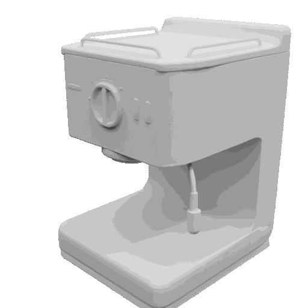
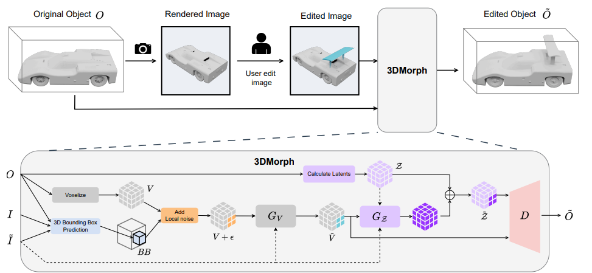

<h1 align="center">3DMorph: Single-Image-Guided Local 3D Shape Editing and Morphing</h1>
<!--<p align="center"><a href="link_to_paper"></a>
<a href='link_to_github_io'></a> -->

<table>
  <tr>
    <td></td>
    <td></td>
  </tr>
</table>

**3DMorph** is a *training-free* framework that enables local 3D shape editing guided by a *single* rendered image with simple edits.

- Preserves unmodified regions with high fidelity

- Allows precise and seamless local modifications

- Supports continuous morphing between shapes for visualization and design exploration



To evaluate editing quality, we also introduce a **dataset of paired 3D objects** that differ only in one local part. 

Experiments show that 3DMorph outperforms state-of-the-art generative and 3D editing methods in translating intuitive 2D manipulations into 3D.


<!-- Installation -->
## 📦 Installation
### Prerequisites
- **System**: The code is currently tested only on **Linux** (Ubuntu 22.04).
- **Hardware**: An NVIDIA GPU with at least 20GB of memory is necessary.
- **Python**: 3.10

### Installation Steps
1. First please follow the environment set up in [TRELLIS](https://github.com/microsoft/TRELLIS?tab=readme-ov-file#-installation)

2. Download [pretrained weights](https://huggingface.co/microsoft/TRELLIS-image-large) under `pretrained_weights/TRELLIS-image-large`
    ```
    pretrained_weights/
    └── TRELLIS-image-large/
        ├── ckpts/
        ├── .gitattributes
        ├── pipeline.json
        └── README.md
    ```
3. Install other dependencies from `requirements.txt`:
    ```bash
    pip install -r requirements.txt
    ``` 

4. Initialize **flexicubes** by running:
    ```bash
    git submodule init
    git submodule update
    ``` 

5. Set the path to your blender installation in [render_simple.py](_3DMorph/renderer/render_simple.py): `self.blender_path = 'path/to/your/blender'`

<!-- Usage -->
## 💡 Usage

A straightforward way to try out **3DMorph** is to run the [`example_inpaint.py`](./example_inpaint.py) script. It expects an input `work_dir` that should have the following structure:
```
work_dir/
│
├── unmodified.obj                # Original mesh
│
├── explore_inpaint/
│   ├── unmodified.png            # Rendering of the original
│   ├── modified.png              # Inpainted rendering of the original
│   └── transforms.json           # The camera parameters used for rendering
│
└── features/
    └── unmodified_slat.npz       # SLat of the original mesh
```
[`example_objects`](./assets/example_objects/) contains several inpaints that can be used right away as `work_dir`. Otherwise, you can also come up with your own inpaints by leveraging image diffusion models or your drawing/photoshop skills.

### Statistical Analysis
To analyze our precomputed benchmark data look into this [`notebook`](./_3DMorph/statistics_analysis/analyze_results.ipynb). It relies on the metric data in [`here`](./_3DMorph/statistics_analysis/evaluation_results). For all inpaints you generated with the previous script you can also visualize the qualitative results using this [`notebook`](./_3DMorph/statistics_analysis/color_diff.ipynb).

### Benchmarking
If you want to recalculate the benchmark results included in the paper, you will need to setup the dataset first:

1. Extract `Assembly_Pairs.zip` to the assets folder

2. Run the [`preparation notebook`](./assets/prepare_dataset.ipynb) and ensure that your dataset has a structure like:
    ```
    Assembly_Pairs/
      └── Assembly_Dataset_*/
          └── some_assembly_mesh_id/                      
              │
              ├── features/
              │   └── new_assembly_without_*_slat.npz
              ├── rendered_views/
              |   ├── render_000.png
              |   ├── ...
              |   ├── render_011.png
              │   └── transforms.json
              │ 
              ├── new_assembly_without_*_voxels.ply
              ├── new_assembly_without_*.obj      
              ├── original_assembly_voxels.ply
              |── original_assembly.obj
              └── transforms.json
    ```
3.  For 3DMorph with bounding box prediction run:
    ```bash
    python _3DMorph/benchmark/benchmark_3DMorph.py --mode benchmark --dataset_dir assets/Assembly_Pairs --output_path results --resolution 1024 --seed 1 --sampler_mode hybrid
    ``` 
    
    For 3DMorph using the ground-truth bounding box run:
    ```bash
    python _3DMorph/benchmark/benchmark_3DMorph-BB.py --mode benchmark --dataset_dir assets/Assembly_Pairs --output_path results --resolution 1024 --seed 1 --sampler_mode hybrid
    ``` 

In case you want to create your own Assembly pairs, please use the [`corresponding notebook`](./assets/generate_assembly_pairs.ipynb).


### Morphing
You can use the [`morphing notebook`](./_3DMorph/morphing/morphing.ipynb) to morph two objects with their <span style="font-size: 16px; font-weight: 600;">SL</span><span style="font-size: 12px; font-weight: 700;">AT</span>. 
You can generate GIFs from single viewing angle or moving ones.

<!-- Dataset -->
## 📚 Dataset

This project uses the [Fusion 360 Gallery Dataset](https://github.com/AutodeskAILab/Fusion360GalleryDataset) 
provided by Autodesk, Inc. The dataset is released under the 
[Fusion 360 Gallery Dataset License](https://github.com/AutodeskAILab/Fusion360GalleryDataset/blob/main/LICENSE), 
which allows usage **only for non-commercial research purposes**. Redistribution of the dataset is not permitted.  

We provide all object pairs generated by us in `Assembly_Pairs.zip`. The filename of each modified object contains all deactivated part indices.

You can download the original **Assembly Dataset** using [assembly_download.py](https://github.com/AutodeskAILab/Fusion360GalleryDataset/blob/master/tools/assembly_download/assembly_download.py).

<!-- License -->
## ⚖️ License

3DMorph is released under the [MIT License](LICENSE).

This project builds upon and extends [**TRELLIS**](https://github.com/JeffreyXiang/TRELLIS), which is also licensed under the [MIT License](https://github.com/JeffreyXiang/TRELLIS/blob/main/LICENSE).

In addition, the following submodules/components are included under their respective licenses:

- [**diffoctreerast**](https://github.com/JeffreyXiang/diffoctreerast):  
  A CUDA-based real-time differentiable octree renderer for radiance fields,  
  derived from the [diff-gaussian-rasterization](https://github.com/graphdeco-inria/diff-gaussian-rasterization) project.  
  Licensed under its own [LICENSE](https://github.com/JeffreyXiang/diffoctreerast/blob/master/LICENSE).

- [**Modified Flexicubes**](https://github.com/MaxtirError/FlexiCubes):  
  We use a modified version of [Flexicubes](https://github.com/nv-tlabs/FlexiCubes) to support vertex attributes.  
  Licensed under the [LICENSE](https://github.com/nv-tlabs/FlexiCubes/blob/main/LICENSE.txt).

- [**Fusion 360 Gallery Dataset**](https://github.com/AutodeskAILab/Fusion360GalleryDataset):  
  This project uses the Fusion 360 Gallery Dataset provided by Autodesk, Inc.  
  Licensed under the [Fusion 360 Gallery Dataset License](https://github.com/AutodeskAILab/Fusion360GalleryDataset/blob/main/LICENSE).  
  The dataset may only be used for **non-commercial research purposes**. Redistribution of the dataset is not permitted.  
  For convenience, we provide a notebook to facilitate quick downloading from the official source.


